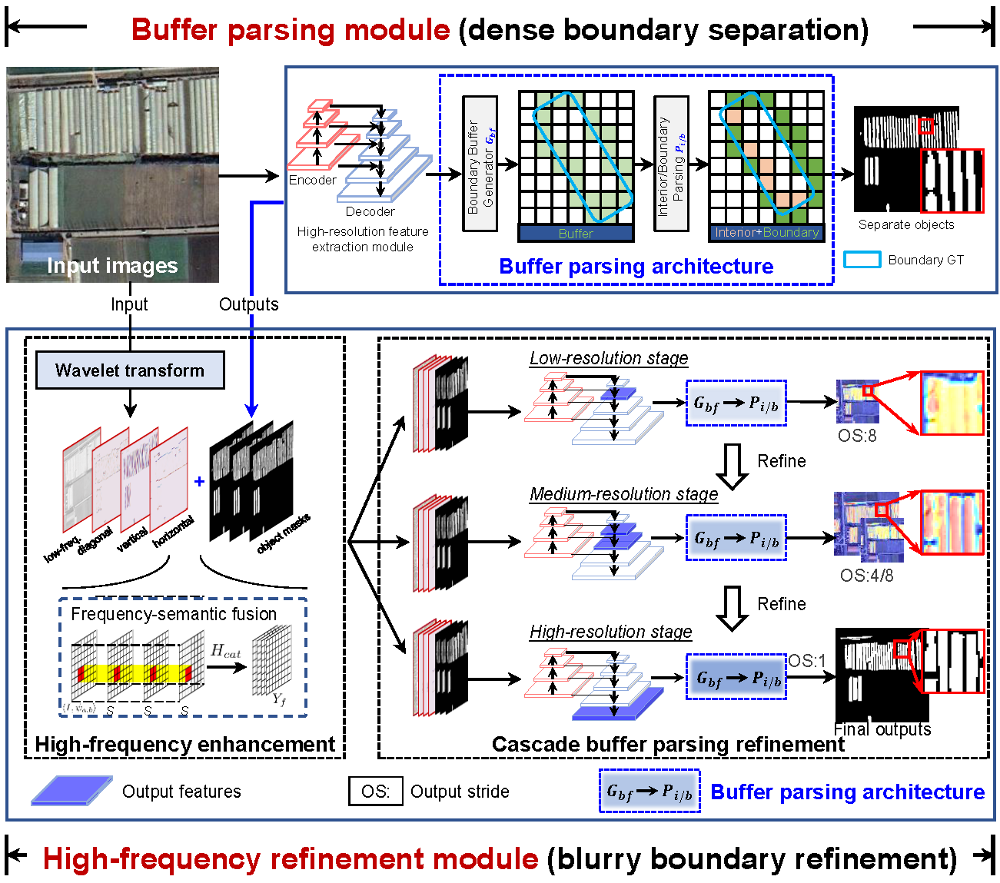

### BPNet: Blurry dense object extraction based on buffer parsing network for high-resolution satellite remote sensing imagery



The repo is based on [Frame-Field-Learning](https://github.com/Lydorn/Polygonization-by-Frame-Field-Learning) and [CascadePSP](https://github.com/hkchengrex/CascadePSP).

### Introduction
Despite the remarkable progress of deep learning-based object extraction in revealing the number and boundary location of geo-objects for high-resolution satellite imagery, it still faces challenges in accurately extracting blurry dense objects. Unlike general objects, blurry dense objects have limited spatial resolution, leading to inaccurate and connected boundaries. Even with the improved spatial resolution and recent boundary refinement methods for general object extraction, connected boundaries may remain undetected in blurry dense object extraction if the gap between object boundaries is less than the spatial resolution. This paper proposes a blurry dense object extraction method named the buffer parsing network (BPNet) for satellite imagery. To solve the connected boundary problem, a buffer parsing module is designed for dense boundary separation. Its essential component is a buffer parsing architecture that comprises a boundary buffer generator and an interior/boundary parsing step. This architecture is instantiated as a dual-task mutual learning head that co-learns the mutual information between the interior and boundary buffer, which estimates the dependence between the dual-task outputs. Specifically, the boundary buffer head generates a buffer region that overlaps with the interior, enabling the architecture to learn the dual-task bias and assign a reliable semantic in the overlapping region through high-confidence voting. To alleviate the inaccurate boundary location problem, BPNet incorporates a high-frequency refinement module for blurry boundary refinement. This module includes a high-frequency enhancement unit to enhance high-frequency signals at the blurry boundaries and a cascade buffer parsing refinement unit that integrates the buffer parsing architecture coarse-to-fine to recover the boundary details progressively. The proposed BPNet framework is validated on two representative blurry dense object datasets for small vehicle and agricultural greenhouse object extraction. The results indicate the superior performance of the BPNet framework, achieving 25.25% and 73.51% in contrast to the state-of-the-art PointRend method, which scored 21.92% and 63.95% in the ${AP50}_{segm}$ metric on two datasets, respectively. Furthermore, the ablation analysis of the super-resolution and building extraction methods demonstrates the significance of high-quality boundary details for subsequent practical applications, such as building vectorization.

## Installation
Please refer to INSTALL.md in [Frame-Field-Learning](https://github.com/Lydorn/Polygonization-by-Frame-Field-Learning) and [CascadePSP](https://github.com/hkchengrex/CascadePSP) for installation and dataset preparation.

## Downloads
Download pretrained weights of the high-frequency refinement module at [here](xxxx) (./models/)

## Getting Started
1. Train a model
```
python main.py --config configs/config.gh_dataset.unet_resnet152_pretrained.json --master_port 1220 --max_epoch 300 -b 4
```

2. Test a dataset
```
python main.py --config configs/config.gh_dataset.unet_resnet152_pretrained.json --mode eval --eval_batch_size 4 --master_port 1221
python main.py --config configs/config.gh_dataset.unet_resnet152_pretrained.json --mode eval_coco --eval_batch_size 4 --master_port 1222
```

3. Inference with pretrained models
```
python main.py --run_name gh_dataset.{run_name} --in_filepath {in_filepath}/images/ --out_dirpath {out_dirpath}/results
```

## Benchmark results
|Model                      |Data           |    Backbone     |    MS  |  Rotate | Lr schd  | box AP | Download|
|:-------------:            |:-------------:| :-------------: | :-----:| :-----: | :-----:  | :----: | :---------------------------------------------------------------------------------------: |
|ReDet                      |DOTA-v1.0       |    ReR50-ReFPN     |   -    |   -    |   1x     |  76.25 |    [cfg](configs/ReDet/ReDet_re50_refpn_1x_dota1.py) [model](https://drive.google.com/file/d/1LCz-Q8PJkr-x9kJk7PcCy37W_cPAdmvO/view?usp=sharing) [log](https://drive.google.com/file/d/1OXgenH6YvtyRUwPH8h9f9p9tBCh60Kln/view?usp=sharing)      |
|ReDet                      |DOTA-v1.0       |    ReR50-ReFPN     |   ✓    |   ✓    |   1x     |  80.10 |    [cfg](configs/ReDet/ReDet_re50_refpn_1x_dota1_ms.py) [model](https://drive.google.com/file/d/1uJb75xTFmQu4db1X8NQKuRNNTrN7TtuA/view?usp=sharing) [log](https://drive.google.com/file/d/1reDaa_ouBfLAZj8Z6wEDsOKxDjeLo0Gt/view?usp=sharing)        |
|ReDet                      |DOTA-v1.5       |    ReR50-ReFPN     |   -    |   -    |   1x     |  66.86 |    [cfg](configs/ReDet/ReDet_re50_refpn_1x_dota15.py) [model](https://drive.google.com/file/d/1AjG3-Db_hmZF1YSKRVnq8j_yuxzualRo/view?usp=sharing) [log](https://drive.google.com/file/d/17dsP9EUbLTV9THkOAA3G3jpmIHHnj83-/view?usp=sharing)        |
|ReDet                      |DOTA-v1.5       |    ReR101-ReFPN     |   -    |   -    |   1x     |  67.62 |    [cfg](configs/ReDet/ReDet_re101_refpn_1x_dota15.py) [model](https://drive.google.com/file/d/1vN4ShOqegn4__QY_hgykota20Qa1mnBQ/view?usp=sharing) [log](https://drive.google.com/file/d/1eKiXI91VudU7rGufdEt526cO8kEm9dAc/view?usp=sharing)        |
|ReDet                      |DOTA-v1.5       |    ReR50-ReFPN     |   ✓    |   ✓    |   1x     |  76.80 |    [cfg](configs/ReDet/ReDet_re50_refpn_1x_dota15_ms.py) [model](https://drive.google.com/file/d/1I1IDmt3juw1sm-CT-zaosVVDldAHYBIO/view?usp=sharing) [log](https://drive.google.com/file/d/1T2Eou26T0mpmP93X_XrFk-AhSicLrgGp/view?usp=sharing)        |
|ReDet                      |HRSC2016        |    ReR50-ReFPN     |   -    |   -    |   3x     |  90.46 |    [cfg](configs/ReDet/ReDet_re50_refpn_3x_hrsc2016.py) [model](https://drive.google.com/file/d/1vTU6OeFD6CX4zkQn7szlgL7Qc_MOZpgC/view?usp=sharing) [log](https://drive.google.com/file/d/1csbm3jop9MGOQt8JaEeBg6TEXOZXY-yo/view?usp=sharing)        |


